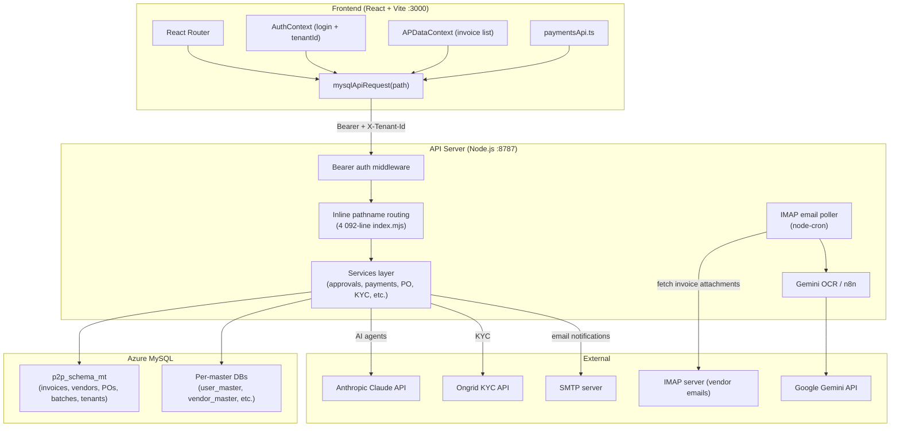

# Procinix S2P — Repository Discovery

> Generated: 2026-05-07. Read actual files; all claims are verifiable.

---

## 1. Project Overview

**Name:** `procinix-p2p-automation-erp`

**Purpose:** Full-stack Procure-to-Pay (P2P) / Source-to-Pay (S2P) ERP platform for Indian mid-market companies. Covers the complete AP workflow: purchase requisitions → purchase orders → goods receipts → invoice ingestion (email + OCR) → three-way matching → approval → payment batching. Includes vendor governance/KYC, MSME compliance, budget management, accounts receivable stubs, and a super-admin console for multi-tenant setup.

**What it does at a high level:**

- Automates AP document lifecycle (PR → PO → GRN → Invoice → Payment)
- Ingests invoices from vendor email via IMAP, extracts data with Google Gemini OCR and/or Anthropic Claude
- Multi-step approval workflows with RBAC
- Master data management (30+ configurable lookup tables)
- Vendor onboarding portal with KYC verification (PAN, GSTIN, Bank, MSME via Ongrid/Gridlines)
- Budget phasing, consumption tracking, cost centre allocation
- Payment batch maker-checker with NEFT/RTGS support

---

## 2. Tech Stack

| Layer                  | Technology                                                                                                                        |
| ---------------------- | --------------------------------------------------------------------------------------------------------------------------------- |
| **Frontend**           | React 18, TypeScript, Vite 6 (SWC), React Router DOM, Tailwind CSS                                                                |
| **UI Components**      | Radix UI (full suite), shadcn/ui conventions, Lucide React icons                                                                  |
| **Charts**             | Recharts                                                                                                                          |
| **Forms**              | React Hook Form + Zod                                                                                                             |
| **Backend**            | Node.js ESM (`node:http` — no Express/Fastify), raw pathname routing                                                              |
| **Database**           | Azure MySQL 8 via `mysql2/promise` (connection pool, 10 connections)                                                              |
| **AI / OCR**           | Google Gemini (`@google/generative-ai`), Anthropic Claude (`ANTHROPIC_API_KEY`)                                                   |
| **Email**              | IMAP polling (`imapflow`), SMTP notifications (`nodemailer`)                                                                      |
| **Scheduling**         | `node-cron` for email polling and PO expiry checks                                                                                |
| **Runtime**            | Node.js (ESM, `--env-file` flag for env loading)                                                                                  |
| **Package manager**    | npm (lockfile: `package-lock.json`); JSR registry in `.npmrc`                                                                     |
| **Build tool**         | Vite 6 (builds to `build/`, chunks: `charts`, `ui-kit`, `ui-utils`, `vendor`)                                                     |
| **Test framework**     | Vitest 4                                                                                                                          |
| **Type checking**      | TypeScript 6, `tsc --noEmit` (strict mode OFF, noImplicitAny OFF)                                                                 |
| **Linters/Formatters** | None configured (no eslint/prettier config found)                                                                                 |
| **CI/CD**              | None (no `.github/workflows`). Deployment configs exist for Railway (`railway.json`) and Heroku-compatible platforms (`Procfile`) |
| **Containerization**   | None (no Dockerfile)                                                                                                              |
| **IaC**                | None                                                                                                                              |

---

## 3. Repository Structure

```
procinix-s2p/
├── index.html                  # Vite HTML shell
├── vite.config.ts              # Vite config: proxy /api → :8787, build chunks
├── tsconfig.json               # TS config (ES2022, strict=false)
├── package.json                # Scripts + dependencies
├── railway.json                # Railway deployment config
├── Procfile                    # Heroku: `web: NODE_ENV=production node server/index.mjs`
├── .env.example                # Template with all required env vars
├── .env.mysql.example          # MySQL-only env template
├── CLAUDE.md                   # AI assistant context (this project)
├── AGENTS.md                   # UI/agent rules pointer
├── README.md                   # High-level developer README
│
├── server/                     # Node.js API server (ESM)
│   ├── index.mjs               # Main server: 4 092 lines, all routes defined inline
│   ├── mysql.mjs               # MySQL connection pool + query helpers
│   ├── masterStorage.mjs       # Registry of 30+ master table names → DB mapping
│   ├── appMail.mjs             # Email utility helpers
│   ├── vendorInvitationMail.mjs# Vendor invite email templates
│   ├── portalWelcomeMail.mjs   # Portal welcome email templates
│   ├── migrations/             # (empty — migrations live in sql/)
│   └── services/
│       ├── invoiceIngestion/   # Email → OCR → validation → creation pipeline
│       ├── invoices/           # Lifecycle state machine, GST/TDS computation
│       ├── agents/             # AI agent orchestration (match, extract, fraud, tax)
│       ├── approvals/          # Multi-module approval queue + KPI service
│       ├── payments/           # Payment batch maker-checker + dashboard
│       ├── po/                 # PO force-closure, expiry, amendment
│       ├── kyc/                # PAN, GSTIN, bank, MSME verification
│       ├── settings/           # DB-persisted app settings store
│       └── tenant/             # Multi-tenant admin helpers
│
├── sql/
│   ├── mysql/
│   │   ├── init.sql            # Base schema (item_master + erp_master_* tables)
│   │   └── migrations/         # 13 named migration files (date-prefixed)
│   ├── 20260412_agent_configurator.sql
│   ├── 002_agentic_agents.sql
│   ├── 003_agent_config.sql
│   ├── invoice_ingestion.sql
│   └── po_management_features.sql
│
├── src/                        # React frontend (TypeScript)
│   ├── main.tsx                # React entry point
│   ├── App.tsx                 # Router + lazy-loaded route tree
│   ├── index.css               # Global CSS + Tailwind base
│   ├── assets/                 # Static images
│   ├── components/             # ~120 feature components (flat, one file = one screen)
│   │   ├── ui/                 # shadcn/ui primitives (Button, Dialog, Table, etc.)
│   │   ├── PurchaseOrders/     # PO sub-components (ExtendPOModal, ForceClosureModal)
│   │   ├── Approvals/          # Approval sub-components
│   │   ├── procurement/        # PR forms, PR listing, PR→PO conversion
│   │   └── ar/                 # AR stubs (Customers, SalesInvoices, Collections, etc.)
│   ├── contexts/               # React contexts (auth, AP data, budget, procurement, RBAC)
│   ├── pages/
│   │   ├── Approvals.tsx       # Cross-module approval inbox
│   │   ├── desks/              # Desk-level pages (ap/, cfo/, operations/, procurement/)
│   │   └── modules/            # Module-level page wrappers
│   ├── data/                   # Static mock data (payments, batches)
│   ├── lib/
│   │   ├── mysql/              # API client (client.ts, documentStore.ts, masterTables.ts)
│   │   ├── masters/            # masterSchemaRegistry.ts — field definitions for all masters
│   │   ├── paymentsApi.ts      # Payments dashboard API helpers
│   │   ├── msmeDueDate.ts      # MSME payment deadline calculator
│   │   └── vendorGovernanceApi.ts
│   ├── hooks/                  # Custom React hooks
│   ├── schemas/                # Zod schemas
│   ├── types/                  # Shared TypeScript types
│   └── utils/
│       ├── __tests__/          # Vitest unit tests (4 files)
│       ├── buildJournalEntries.ts
│       ├── determineGST.ts
│       ├── determineTDS.ts
│       └── apportionBOECharges.ts
│
├── docs/                       # Architecture & spec docs
│   ├── multi-tenancy-spec.md
│   ├── multi-tenancy-existing-state.md
│   ├── universal-ui-rules.md
│   └── ws1a-*.md               # Workstream 1A implementation docs
├── audit/                      # PO design audit notes
└── .cursor/rules/              # Cursor IDE auto-loaded rules
```

---

## 4. Entry Points

| Entry            | Path                                        | Description                                                                                           |
| ---------------- | ------------------------------------------- | ----------------------------------------------------------------------------------------------------- |
| **API server**   | `server/index.mjs`                          | Raw `http.createServer`; loads env via `--env-file=.env.mysql.local`; port 8787                       |
| **Frontend dev** | `npm run dev:web` → Vite                    | Starts Vite on port 3000 (README says 3000; CLAUDE.md says 5173 — actual config: `server.port: 3000`) |
| **Combined dev** | `npm run dev`                               | `concurrently` starts server + waits for port 8787 + starts Vite                                      |
| **Production**   | `NODE_ENV=production node server/index.mjs` | Serves API + static files from `build/`                                                               |
| **React root**   | `src/main.tsx`                              | Mounts `<App />` into `#root`                                                                         |
| **Route tree**   | `src/App.tsx`                               | BrowserRouter + lazy routes                                                                           |
| **Health check** | `GET /health`                               | Returns `{ ok: true, uptime: N }`                                                                     |

---

## 5. Dependencies

### Production (key groups)

| Group             | Packages                                                                                     |
| ----------------- | -------------------------------------------------------------------------------------------- |
| **React UI**      | `react@18`, `react-dom@18`, `react-router-dom` (unpinned `*`), `react-router` (unpinned `*`) |
| **UI primitives** | Full `@radix-ui/*` suite (20+ packages), `lucide-react`, `cmdk`, `vaul`, `sonner`            |
| **Styling utils** | `class-variance-authority`, `clsx`, `tailwind-merge`                                         |
| **Charts**        | `recharts@2`                                                                                 |
| **Forms**         | `react-hook-form@7`, `@hookform/resolvers@5`, `zod@4`                                        |
| **DB**            | `mysql2@3`                                                                                   |
| **AI**            | `@google/generative-ai@0.24`, uses `ANTHROPIC_API_KEY` via raw `fetch`                       |
| **Email**         | `imapflow@1`, `nodemailer@8`                                                                 |
| **Scheduling**    | `node-cron@4`                                                                                |
| **Spreadsheets**  | `xlsx` — loaded from SheetJS CDN (not npm registry — see `.npmrc` + package.json URL)        |
| **Date pickers**  | `react-day-picker@8`                                                                         |
| **Carousel**      | `embla-carousel-react@8`                                                                     |
| **OTP input**     | `input-otp@1`                                                                                |

### Dev

| Group       | Packages                                                   |
| ----------- | ---------------------------------------------------------- |
| **Build**   | `vite@6`, `@vitejs/plugin-react-swc@3`                     |
| **Types**   | `@types/node@20`, `@types/react@19`, `@types/react-dom@19` |
| **Tests**   | `vitest@4`                                                 |
| **Process** | `concurrently@9`, `wait-on@9`                              |
| **TS**      | `typescript@6`                                             |

### Notable version risks

- `react-router` and `react-router-dom` both pinned to `"*"` (accepts any version — dangerous for major upgrades)
- `clsx` and `tailwind-merge` also `"*"`
- `xlsx` loaded from SheetJS CDN URL instead of npm — network-dependent install, may break in air-gapped environments
- No `@babel/runtime` consumers visible in source; package may be a leftover

---

## 6. Configuration

### Environment files

| File                 | Purpose                                                              |
| -------------------- | -------------------------------------------------------------------- |
| `.env.example`       | Full template — commit to git; checked in                            |
| `.env.mysql.example` | MySQL-only subset template                                           |
| `.env.local`         | Local dev overrides (gitignored)                                     |
| `.env.mysql.local`   | MySQL credentials for local dev (gitignored; loaded by `--env-file`) |
| `.env`               | Production-like defaults (gitignored)                                |

### Required environment variables

| Variable                        | Purpose                                                                                                          |
| ------------------------------- | ---------------------------------------------------------------------------------------------------------------- |
| `MYSQL_HOST`                    | Azure MySQL server hostname                                                                                      |
| `MYSQL_DATABASE`                | Database name (e.g. `p2p_schema_mt`)                                                                             |
| `MYSQL_USER` / `MYSQL_PASSWORD` | DB credentials                                                                                                   |
| `MYSQL_PORT`                    | Default 3306                                                                                                     |
| `MYSQL_SSL_MODE`                | `required` (default) or `disabled`                                                                               |
| `API_SECRET_KEY`                | Bearer token for all API calls; if unset, auth is **disabled**                                                   |
| `VITE_API_BASE_URL`             | Frontend base URL — **must include `/api`** (e.g. `http://127.0.0.1:8787/api` locally, `/api` in prod via proxy) |

### Optional but important

| Variable                  | Purpose                                               |
| ------------------------- | ----------------------------------------------------- |
| `GOOGLE_AI_API_KEY`       | Gemini OCR for invoice ingestion                      |
| `GEMINI_MODEL`            | Default `gemini-2.5-pro`                              |
| `ANTHROPIC_API_KEY`       | Claude for agent processing                           |
| `ANTHROPIC_MODEL`         | Default `claude-sonnet-4-20250514`                    |
| `AP_EMAIL_*`              | IMAP credentials for invoice email polling            |
| `SMTP_*` / `MAIL_FROM`    | SMTP for outgoing emails                              |
| `SUPER_ADMIN_EMAILS`      | Comma-separated emails allowed to call `/api/admin/*` |
| `VITE_SUPER_ADMIN_EMAILS` | Client-side super-admin nav visibility                |
| `KYC_PROVIDER`            | `ongrid` (default)                                    |
| `ONGRID_API_KEY`          | KYC verification API key                              |
| `ONGRID_MOCK_MODE`        | `true` to skip real KYC API calls                     |
| `N8N_WEBHOOK_URL`         | Alternative OCR via n8n webhook                       |
| `PORT`                    | Server port (default 8787)                            |
| `CORS_ALLOWED_ORIGINS`    | Comma-separated allowed origins                       |

### Feature flags

- `ONGRID_MOCK_MODE=true` — disables live KYC calls
- `MIGRATE_DRY_RUN=1` — makes migration scripts non-destructive
- `API_SECRET_KEY` unset — disables API authentication entirely (dev mode)

---

## 7. Build / Run / Test

### Install

```bash
npm install
cp .env.mysql.example .env.mysql.local
# Edit .env.mysql.local with your Azure MySQL credentials
```

### Run locally

```bash
npm run dev          # Starts API server (:8787) + Vite dev server (:3000) concurrently
npm run server:mysql # API server only (no Vite)
npm run dev:web      # Vite only (requires server already running)
```

### Run tests

```bash
npm test             # vitest run (all tests, no watch)
```

Tests live in:

- `src/utils/__tests__/` — 4 unit tests (GST, TDS, journal entries, BOE charges)
- `server/services/invoices/__tests__/` — 7 unit tests (lifecycle, GST, TDS, vendor ledger, duplicate detection)
- `server/services/agents/__tests__/` — 1 unit test (matchAgent)

### Type check

```bash
npm run typecheck    # tsc --noEmit (frontend only; server excluded from tsconfig)
```

### Build for production

```bash
npm run build        # Vite build → build/
npm run start        # NODE_ENV=production node server/index.mjs (serves API + static)
```

### Database migrations (run manually)

```bash
npm run migrate:tenant-schema        # Apply multi-tenancy migration
npm run migrate:tenant-schema:dry    # Dry run (no changes)
node --env-file=.env.mysql.local server/scripts/runWs1aMigration2a.mjs
# ... 2b, 2c, 2d, 2f scripts for WS1A baseline
```

---

## 8. Architecture

### High-level data flow



### Key design patterns

1. **Flat server routing** — all ~70 API routes are if/else chains in a single `server/index.mjs`. No framework, no middleware chain. Auth check is at the top.

2. **Master data registry** — `server/masterStorage.mjs` maps 30+ master names to their database/table/auditTable names. All master CRUD routes share a generic handler keyed by master name.

3. **Domain documents** — `src/lib/mysql/documentStore.ts` stores JSON blobs for domains like `procurement_data`, `ap_data`, `budget_data` in a single `domain_documents` table. Used for PR/PO/GRN/Advance data that isn't yet in normalized tables.

4. **Invoice lifecycle state machine** — `server/services/invoices/lifecycleTransitions.mjs` enforces valid state transitions. `lifecycleMapping.mjs` maps legacy/processing status strings to canonical states.

5. **AI agent pipeline** — `server/services/agents/orchestrator.mjs` chains specialized agents (extract, match, tax compliance, duplicate fraud, vendor identity, workflow routing) to process ingested invoices.

6. **Multi-tenant context** — Every AP endpoint requires `X-Tenant-Id` header. The `tenants` + `entities` + `user_entity_access` tables scope all data.

7. **Approval sync loop** — `startApprovalSyncLoop()` in `approvalService.mjs` runs periodically to sync approval state across modules.

---

## 9. Data Layer

### Database: Azure MySQL (`p2p_schema_mt`)

#### Core tables (in `p2p_schema_mt`)

| Table                          | Purpose                                                                 |
| ------------------------------ | ----------------------------------------------------------------------- |
| `tenants`                      | Multi-tenant root (tenant_id, code, name)                               |
| `entities`                     | Business entities per tenant                                            |
| `user_entity_access`           | User ↔ entity access grants                                             |
| `invoices`                     | AP invoice lifecycle (status, lifecycle_state, amounts, vendor, PO ref) |
| `invoice_lines`                | Line items per invoice                                                  |
| `invoice_ingestion_logs`       | Email ingestion run log                                                 |
| `invoice_ingestion_exceptions` | Failed/exceptional ingestion events                                     |
| `vendors`                      | Vendor master (p2p_schema_mt scope)                                     |
| `payment_batches`              | Maker-checker payment batches                                           |
| `payment_batch_lines`          | Invoice lines per batch                                                 |
| `payments`                     | Executed payment records                                                |
| `ap_vendor_learning_map`       | OCR vendor name → vendor_id ML learning                                 |
| `ap_field_learning_map`        | OCR field → value ML learning                                           |
| `app_settings`                 | Key-value app configuration                                             |
| `domain_documents`             | JSON blobs for PRs, POs, GRNs, Advances, Budget                         |
| `ap_agent_config`              | Agent pipeline configuration per tenant                                 |
| `agentic_agents`               | Agent definitions                                                       |
| `agent_processing_queue`       | Invoice agent processing queue                                          |

#### Master data databases (separate MySQL databases)

Each master has its own database matching the master key (e.g. `user_master.user_master`, `vendor_master.vendor_master`). Schemas are generic: `(id, record_code, record_name, status, approval_status, payload JSON)`.

#### Migrations

Located in `sql/mysql/migrations/`, date-prefixed. Applied manually via scripts in `server/scripts/`. No ORM; raw SQL.

Key migrations:

- `20260206_payment_batches.sql` — payment_batches + payment_batch_lines + payments tables
- `20260421_multi_tenant_entity.sql` — tenants, entities, user_entity_access
- `20260424_ws1a_2*.sql` — baseline schema, alterations, new tables, seed data, turnover columns

#### External APIs integrated

- **Google Gemini** — invoice OCR extraction
- **n8n webhook** — alternative OCR pipeline
- **Anthropic Claude** — agent-based invoice reasoning
- **Ongrid/Gridlines** — PAN, GSTIN, bank account, MSME verification

---

## 10. APIs / Interfaces

### HTTP API (all `http://server:8787/api/...`)

**Auth:** `Authorization: Bearer <API_SECRET_KEY>` on all non-public endpoints.

#### Auth & Tenant

| Method   | Path                              | Description                       |
| -------- | --------------------------------- | --------------------------------- |
| POST     | `/api/auth/platform-context`      | Resolve tenantId → entity context |
| GET      | `/api/entities`                   | List entities for current tenant  |
| GET      | `/api/admin/tenants`              | Super-admin: list all tenants     |
| POST     | `/api/admin/tenants`              | Super-admin: create tenant        |
| GET/POST | `/api/admin/tenants/:id/entities` | Super-admin: entity CRUD          |

#### Invoices (`X-Tenant-Id` required for AP endpoints)

| Method | Path                          | Description                                       |
| ------ | ----------------------------- | ------------------------------------------------- |
| GET    | `/api/invoices`               | List invoices (lifecycle state, payment progress) |
| GET    | `/api/invoices/:id`           | Single invoice detail                             |
| PUT    | `/api/invoices/:id`           | Update invoice                                    |
| GET    | `/api/invoices/:id/pdf`       | Invoice PDF                                       |
| GET    | `/api/invoices/:id/audit-log` | Audit trail                                       |
| POST   | `/api/invoices/:id/verify`    | Verify invoice                                    |
| POST   | `/api/invoices/:id/match`     | Run PO matching                                   |
| POST   | `/api/invoices/:id/reject`    | Reject invoice                                    |
| POST   | `/api/invoices/:id/resubmit`  | Resubmit after exception                          |
| POST   | `/api/invoices/:id/resume`    | Resume from exception hold                        |
| POST   | `/api/invoices/:id/exception` | Flag exception                                    |

#### Payments

| Method | Path                                  | Description                |
| ------ | ------------------------------------- | -------------------------- |
| GET    | `/api/ap/payments-dashboard`          | KPIs + invoice list        |
| GET    | `/api/ap/payable-invoices`            | Invoices ready for payment |
| GET    | `/api/ap/payment-batches`             | List batches               |
| POST   | `/api/ap/payment-batches`             | Create batch               |
| POST   | `/api/ap/payment-batches/:id/submit`  | Submit for approval        |
| POST   | `/api/ap/payment-batches/:id/approve` | Approve batch              |
| POST   | `/api/ap/payment-batches/:id/reject`  | Reject batch               |
| POST   | `/api/ap/payment-batches/:id/execute` | Execute payment            |

#### Invoice Ingestion

| Method    | Path                                     | Description              |
| --------- | ---------------------------------------- | ------------------------ |
| GET       | `/api/invoice-ingestion/workbench-stats` | OCR stats                |
| POST      | `/api/invoice-ingestion/trigger`         | Manual poll trigger      |
| GET       | `/api/invoice-ingestion/logs`            | Ingestion log list       |
| GET       | `/api/invoice-ingestion/logs/:id`        | Single log detail        |
| POST      | `/api/invoice-ingestion/manual-upload`   | Upload invoice PDF/image |
| POST      | `/api/invoice-ingestion/revalidate/:id`  | Re-run validation        |
| POST      | `/api/invoice-ingestion/reprocess/:id`   | Re-run full pipeline     |
| GET/PATCH | `/api/invoice-ingestion/exceptions`      | Exception list / resolve |

#### Master Data

| Method         | Path                      | Description                  |
| -------------- | ------------------------- | ---------------------------- |
| GET            | `/api/masters/:masterKey` | Fetch all records for master |
| PUT            | `/api/masters/:masterKey` | Bulk replace master records  |
| GET            | `/api/items`              | Item master list             |
| POST           | `/api/items`              | Create item                  |
| GET/PUT/DELETE | `/api/items/:id`          | Item CRUD                    |
| GET            | `/api/vendors`            | Vendor list                  |
| GET/PUT/DELETE | `/api/vendors/:id`        | Vendor CRUD                  |
| POST           | `/api/vendors/:id/submit` | Submit vendor for approval   |

#### Approvals

| Method   | Path                            | Description               |
| -------- | ------------------------------- | ------------------------- |
| GET      | `/api/approvals/queue`          | Pending approval queue    |
| GET      | `/api/approvals/kpis`           | Approval KPIs             |
| GET      | `/api/approvals/module-counts`  | Per-module pending counts |
| POST     | `/api/approvals/bulk-approve`   | Bulk approval             |
| GET      | `/api/approvals/msme-alerts`    | MSME overdue alerts       |
| GET      | `/api/approvals/:id/detail`     | Single item detail        |
| POST     | `/api/approvals/:id/approve`    | Approve item              |
| POST     | `/api/approvals/:id/reject`     | Reject item               |
| GET/POST | `/api/master-approvals/pending` | Master data approvals     |

#### Purchase Orders

| Method   | Path                                           | Description           |
| -------- | ---------------------------------------------- | --------------------- |
| POST     | `/api/purchase-orders/:id/extend`              | Extend PO validity    |
| POST     | `/api/purchase-orders/:id/force-close`         | Force-close PO        |
| GET      | `/api/purchase-orders/:id/force-close/preview` | Force-closure preview |
| POST/GET | `/api/purchase-orders/:id/amendments`          | PO amendment          |

#### KYC

| Method | Path                                |
| ------ | ----------------------------------- |
| POST   | `/api/kyc/verify-pan`               |
| POST   | `/api/kyc/verify-pan-comprehensive` |
| POST   | `/api/kyc/verify-gstin`             |
| POST   | `/api/kyc/verify-bank`              |
| POST   | `/api/kyc/verify-msme`              |

#### Other

- `GET /health` — liveness
- `GET /api/mysql/health` — DB connectivity
- `GET /api/settings`, `PUT /api/settings/:key` — app settings
- `GET /api/workflows/approval-levels`, `PUT /api/workflows/approval-levels`
- `GET /api/workflows/configurations`, `PUT /api/workflows/configurations`
- `GET /api/gl-codes`, `POST /api/gl-codes`, `GET /api/gl-codes/search`
- `POST /api/vendor-invitations/send`
- `POST /api/portal-users/welcome-email`
- `GET/PUT /api/documents/:domain` — domain document store
- `GET /api/ap/vendor-learning/resolve`, `POST /api/ap/vendor-learning/learn`
- `GET /api/ap/field-learning/resolve`, `POST /api/ap/field-learning/learn`

### Frontend client API (`src/lib/mysql/client.ts`)

```typescript
mysqlApiRequest<T>(path: string, init?: RequestInit): Promise<T>
// path must start with '/<route>' — NEVER '/api/<route>'
// Automatically adds Bearer token and Content-Type headers
```

**Important invariant:** `VITE_API_BASE_URL` already ends with `/api`, so paths like `/invoices` resolve correctly. Paths like `/api/invoices` produce a double-`/api/api/` 404.

---

## 11. Tests

### What exists

| Location                                               | Framework | Count   | Coverage area                                                                                         |
| ------------------------------------------------------ | --------- | ------- | ----------------------------------------------------------------------------------------------------- |
| `src/utils/__tests__/*.test.ts`                        | Vitest    | 4 files | GST computation, TDS determination, journal entry building, BOE charge apportionment                  |
| `server/services/invoices/__tests__/*.test.mjs`        | Vitest    | 7 files | Invoice lifecycle transitions/mapping, GST, TDS, vendor ledger, GSTIN validation, duplicate detection |
| `server/services/agents/__tests__/matchAgent.test.mjs` | Vitest    | 1 file  | PO match agent (DB mocked via `vi.mock`)                                                              |

**Total: 12 test files** — all unit-level.

### How to run

```bash
npm test             # runs all tests once
npx vitest           # watch mode
npx vitest run --reporter=verbose
```

### Coverage gaps

- No integration tests (no actual DB calls in tests)
- No E2E tests (no Playwright/Cypress)
- No tests for the 4 000-line `server/index.mjs` route handlers
- No tests for email polling / OCR pipeline
- No tests for payment batch workflow
- No tests for approval service
- No tests for KYC verification
- No tests for React components (no React Testing Library setup)
- Frontend util tests don't cover edge cases for Indian tax rules at boundary amounts

---

## 12. Code Quality Observations

### Positives

- Invoice lifecycle enforced via explicit state machine (`lifecycleTransitions.mjs`)
- Timing-safe bearer token comparison (`timingSafeEqual`) in auth middleware
- Master data audit tables for every write operation
- Consistent `sendJson` / `sendError` response helpers in server

### Concerns

**Security**

- Passwords in `user_master` are stored in **plaintext** in the JSON `payload` field and compared client-side (`AuthContext.tsx:615`). Must be hashed before any production exposure.
- `loginFromMasters` fetches all user records from `/api/masters/user_master` to the **browser** and does password comparison client-side — credentials are transmitted but comparison is insecure by design.
- `API_SECRET_KEY` empty = authentication fully disabled. This is documented as "dev mode" but is a footgun if a deployment omits the var.
- Bare `fetch('/api/...')` calls in `EntityMaster.tsx`, `InvoiceFormPO.tsx:222`, `pages/Approvals.tsx` bypass `mysqlApiRequest` (no auth headers helper).

**Architecture**

- `server/index.mjs` is 4 092 lines of inline if/else routing — massive single file, hard to navigate and test.
- TypeScript `strict: false` and `noImplicitAny: false` — type safety is permissive; errors can hide.
- 7 pre-existing TS errors in `InvoiceFormPO.tsx`, `NonPOInvoiceForm.tsx`, `VendorGroupMaster.tsx`.
- `src/components/` contains ~120 components in a flat directory — no subdirectory organization beyond `ui/`, `Approvals/`, `PurchaseOrders/`, `procurement/`, `ar/`.
- `src/` contains dozens of stale documentation `.md` files that should live in `docs/` or be deleted.

**Data**

- Domain documents (PR/PO/GRN/Advance/Budget) stored as JSON blobs in `domain_documents` — no relational integrity, no schema validation, hard to query.
- No database migration runner / version tracking — migrations are applied by running scripts manually.
- `react-router` and `react-router-dom` pinned to `"*"` — will blindly upgrade to breaking major versions.
- `xlsx` loaded from SheetJS CDN URL — fragile, not reproducible without network.

**TODOs found**

- `SKUMaster.tsx:877,897,901` — dropdowns for material, color, size masters not wired
- `PRtoPOConversionEnhanced.tsx:116` — GRN consumption tracking not wired
- `masterSchemaRegistry.ts:1365,1447` — Account Code Master and Bank Master have no dedicated UI screens

---

## 13. Risks & Gaps

| Risk                                       | Severity     | Notes                                                                                     |
| ------------------------------------------ | ------------ | ----------------------------------------------------------------------------------------- |
| Plaintext passwords client-side            | **Critical** | Must hash before any real user data or production exposure                                |
| No integration or E2E tests                | High         | Business-critical AP flows (payment batches, approvals) have zero automated test coverage |
| 4 092-line monolithic server file          | High         | Difficult to maintain; any regression in auth or routing affects all endpoints            |
| `react-router "*"` version pin             | Medium       | Automatic breaking-version upgrade possible on `npm install`                              |
| No DB migration runner                     | Medium       | Schema state is tribal knowledge; no way to know which migrations have been applied       |
| Domain documents as JSON blobs             | Medium       | PR/PO/GRN data cannot be queried relationally; no foreign key enforcement                 |
| No linter / formatter                      | Medium       | Code style is inconsistent; no automated quality gates                                    |
| `VITE_API_BASE_URL` double-`/api/` footgun | Medium       | Documented and fixed, but easy to reintroduce in new API calls                            |
| Bare `fetch` calls bypassing auth          | Low          | Dev-only via Vite proxy, but should be migrated to `mysqlApiRequest`                      |
| No CI pipeline                             | Low          | No automated build/test on push                                                           |
| Stale `.md` files in `src/`                | Low          | ~40 stale planning/notes files in the source tree                                         |
| Orphan tenant/entity rows in DB            | Low          | `PTPL` tenant and `Opptra` entity exist with no users; harmless but confusing             |

---

## 14. Onboarding Checklist

A new developer's day-1 setup:

1. **Clone the repo**

   ```bash
   git clone <repo-url>
   cd procinix-s2p
   ```

2. **Install Node.js** — project uses ESM features and `--env-file` flag; Node.js 20+ required.

3. **Install dependencies**

   ```bash
   npm install
   ```

   Note: `xlsx` is fetched from `cdn.sheetjs.com` — requires internet access.

4. **Set up environment files**

   ```bash
   cp .env.example .env.local
   cp .env.mysql.example .env.mysql.local
   ```

   Edit `.env.mysql.local` with Azure MySQL credentials (get from team lead).
   Set `VITE_API_BASE_URL=http://127.0.0.1:8787/api` in `.env.local`.

5. **Verify DB access**

   ```bash
   npm run server:mysql
   # In another terminal:
   curl http://127.0.0.1:8787/api/mysql/health
   ```

6. **Run migrations** (if fresh DB)

   ```bash
   node --env-file=.env.mysql.local server/scripts/runMultiTenancyMigration.mjs
   node --env-file=.env.mysql.local server/scripts/runWs1aMigration2a.mjs
   # etc. — run 2b, 2c, 2d, 2f in order
   ```

7. **Start dev environment**

   ```bash
   npm run dev
   ```

   Frontend at `http://localhost:3000`, API at `http://localhost:8787`.

8. **Log in**
   - Navigate to `http://localhost:3000/login`
   - Email: `mithilesh@procinix.ai` / Password: `Demo@123`
   - After login, browser console should show `[AuthContext] post-merge user: { tenantId: 'tenant-default-001', ... }`

9. **Run tests**

   ```bash
   npm test
   ```

10. **Read key files**
    - `CLAUDE.md` — current known state, fixed bugs, gotchas
    - `docs/multi-tenancy-spec.md` — multi-tenant design
    - `docs/universal-ui-rules.md` — UI conventions
    - `server/index.mjs:1-120` — imports + server bootstrap
    - `server/masterStorage.mjs` — master data registry
    - `src/lib/mysql/client.ts` — API client invariant (no `/api/` prefix in paths)

11. **Key gotcha:** Every path passed to `mysqlApiRequest()` must start with `/<route>`, never `/api/<route>`. `VITE_API_BASE_URL` already ends with `/api`.

---

## 15. Open Questions

1. **Password hashing** — Is there a plan to migrate plaintext passwords to bcrypt/argon2? Is `user_master` intended to be replaced by a proper auth service (e.g. Supabase Auth, Auth0)?

2. **Migration runner** — Is there a planned tool to track which SQL migrations have been applied to a given DB? Are migrations idempotent enough to re-run?

3. **Domain documents vs relational tables** — Is the `domain_documents` JSON-blob approach for PRs/POs/GRNs temporary scaffolding, or a deliberate design? The `CLAUDE.md` marks `/api/purchase-orders` etc. as "missing endpoints" — is there a roadmap to normalize these?

4. **Vite port** — `CLAUDE.md` says port 5173, `vite.config.ts` sets `server.port: 3000`. Which is authoritative? (Observed: 3000.)

5. **Multi-tenant production readiness** — The DB has one real tenant (`tenant-default-001`). Are the multi-tenancy migration scripts (WS1A) stable for a second tenant to be onboarded?

6. **AI model selection** — Server uses `ANTHROPIC_MODEL=claude-sonnet-4-20250514` (via env) but also has a hardcoded model reference in `geminiOCR.mjs`. Is the model configurable per-agent or global?

7. **`xlsx` CDN dependency** — Is there a plan to pin to an npm version? The CDN URL (`cdn.sheetjs.com/xlsx-latest`) resolves to "latest" — non-deterministic builds.

8. **Approval sync loop** — `startApprovalSyncLoop()` runs in the server background. What is the poll interval? What happens if the loop crashes?

9. **AR module** — The `src/components/ar/` components (Customers, SalesInvoices, Collections, etc.) appear to be stubs. Is AR in scope for this product?

10. **Super-admin console** — `SUPER_ADMIN_EMAILS` controls access. Is this intended for Procinix staff only, or will customers have super-admin access?
